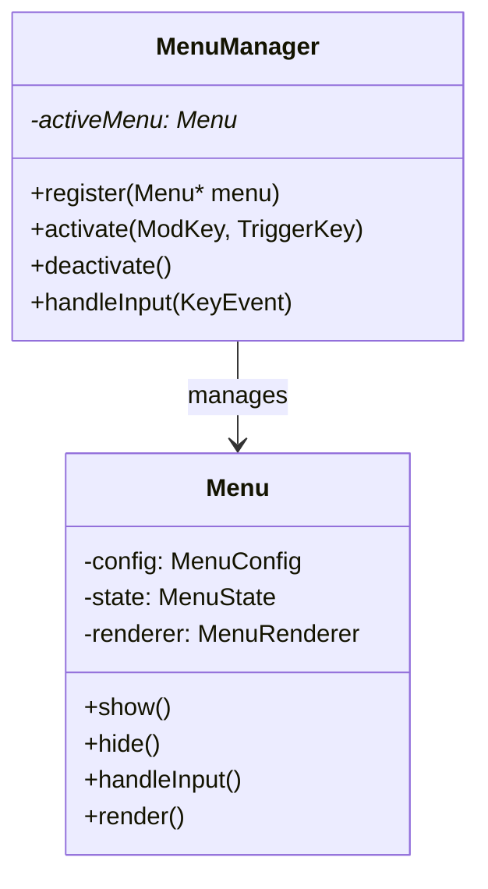
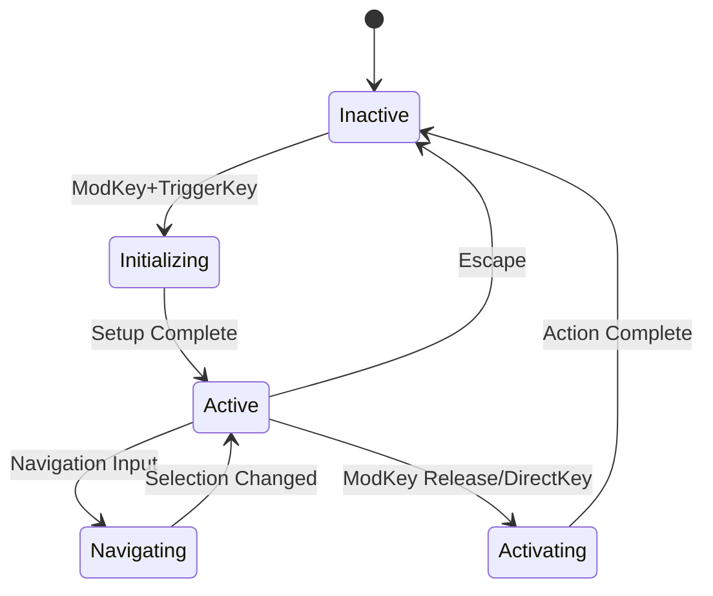

# Menu Extension Architecture

## Overview

This document details the architecture for a flexible menu extension system that supports configurable key combinations, menu lifecycle management, and extensible navigation controls.

## Core Components

### 1. Menu Manager



The MenuManager is responsible for:
- Maintaining single menu focus
- Handling menu activation/deactivation
- Routing input events
- Managing menu lifecycle states

### 2. Core Menu Types

```c
// Menu configuration
typedef struct {
    uint16_t mod_key;      // Modifier key (Super, Alt, etc)
    uint8_t trigger_key;   // Activation key when mod is pressed
    const char* title;     // Menu title
    MenuItem* items;       // Array of menu items
    size_t item_count;     // Number of items
    NavigationConfig nav;  // Navigation configuration
    ActivationConfig act;  // Activation behavior
} MenuConfig;

// Menu state tracking
typedef struct {
    bool visible;
    int selected_index;
    bool mod_active;      // Tracks if modifier is still held
    MenuLifecycleState state;
} MenuState;

// Menu item definition
typedef struct {
    const char* id;       // Unique identifier
    const char* label;    // Display text
    void (*action)(void* user_data);  // Action callback
    void* metadata;       // Optional metadata
} MenuItem;
```

### 3. Navigation System

```c
// Navigation configuration
typedef struct {
    struct {
        uint8_t key;      // Key code
        char* label;      // Key label for display
    } next;
    
    struct {
        uint8_t key;
        char* label;
    } prev;
    
    struct {
        uint8_t* keys;    // Array of direct selection keys
        size_t count;     // Number of direct keys
    } direct;
    
    void* extension_data; // For future navigation extensions
} NavigationConfig;

// Navigation callbacks
typedef struct {
    void (*next)(Menu* menu);
    void (*prev)(Menu* menu);
    void (*direct)(Menu* menu, int index);
    void (*custom)(Menu* menu, void* data);
} NavigationCallbacks;
```

### 4. Activation System

```c
// Activation configuration
typedef struct {
    bool activate_on_mod_release;     // Activate when modifier released
    bool activate_on_direct_key;      // Activate on number key press
    void (*custom_activate)(Menu* menu, void* user_data);
    void* user_data;
} ActivationConfig;
```

## Menu Lifecycle



### State Descriptions

1. **Inactive**: Menu is not visible or processing input
2. **Initializing**: Setting up menu display and input handlers
3. **Active**: Menu is visible and accepting input
4. **Navigating**: Processing navigation input (j/k/numbers)
5. **Activating**: Executing selected item's action

## Input Handling

```c
bool menu_handle_input(Menu* menu, InputEvent* event) {
    switch (event->type) {
        case KEY_PRESS:
            return handle_key_press(menu, event);
        case KEY_RELEASE:
            return handle_key_release(menu, event);
        case MOD_CHANGE:
            return handle_mod_change(menu, event);
    }
    return false;
}
```

### Key Handling Rules:
1. Mod+TriggerKey activates menu
2. j/k (configurable) navigate items
3. 1-4 directly select and activate items
4. Escape dismisses menu
5. Mod key release activates current selection (if configured)

## Rendering System

The menu rendering system uses Cairo for graphics:

```c
typedef struct {
    cairo_t* cr;
    cairo_surface_t* surface;
    MenuStyle style;
    int width;
    int height;
    void (*pre_render)(Menu* menu);
    void (*post_render)(Menu* menu);
} MenuRenderer;

typedef struct {
    double background_color[4];
    double text_color[4];
    double highlight_color[4];
    char* font_face;
    double font_size;
    int item_height;
    int padding;
} MenuStyle;
```

## Extension Points

1. **Navigation Extensions**
   - Custom key bindings
   - Additional navigation modes
   - Search/filter functionality

2. **Activation Behavior**
   - Custom activation triggers
   - Multi-step activation
   - Conditional activation

3. **Future Features**
   - Nested menus
   - Menu groups
   - Dynamic item updates

## Example Implementation

```c
// Create window switcher menu
MenuConfig window_menu = {
    .mod_key = XCB_MOD_MASK_4,  // Super key
    .trigger_key = XK_w,        // 'w' key
    .title = "Window Switcher",
    .nav = {
        .next = { .key = XK_j, .label = "j" },
        .prev = { .key = XK_k, .label = "k" },
        .direct = {
            .keys = (uint8_t[]){XK_1, XK_2, XK_3, XK_4},
            .count = 4
        }
    },
    .act = {
        .activate_on_mod_release = true,
        .activate_on_direct_key = true,
        .custom_activate = window_activate_callback
    }
};

// Initialize menu system
Menu* menu = menu_create(&window_menu);
menu_manager_register(manager, menu);
```

## API Reference

### Menu Manager API
```c
MenuManager* menu_manager_create(void);
void menu_manager_destroy(MenuManager* manager);
bool menu_manager_register(MenuManager* manager, Menu* menu);
void menu_manager_handle_input(MenuManager* manager, InputEvent* event);
```

### Menu API
```c
Menu* menu_create(MenuConfig* config);
void menu_destroy(Menu* menu);
void menu_show(Menu* menu);
void menu_hide(Menu* menu);
bool menu_handle_input(Menu* menu, InputEvent* event);
void menu_render(Menu* menu);
```

### Navigation API
```c
void menu_select_next(Menu* menu);
void menu_select_prev(Menu* menu);
void menu_select_index(Menu* menu, int index);
void menu_register_navigation(Menu* menu, NavigationCallbacks* callbacks);
```

## Integration Guide

1. Create menu configuration
2. Initialize menu manager
3. Register menus
4. Connect input handlers
5. Configure activation behavior
6. Implement render callbacks

## Dependencies
- XCB for window management
- Cairo for rendering
- X11 for input handling