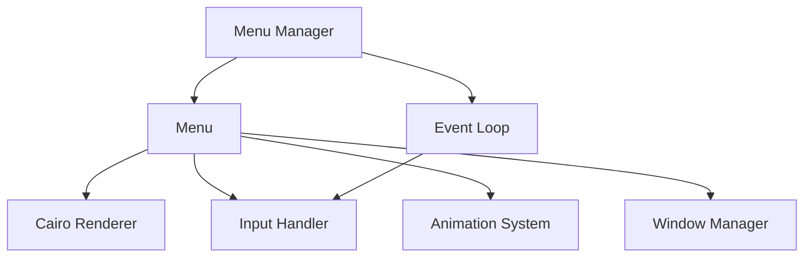

# X11 Menu Extension System

A flexible and extensible menu system for X11 window managers, supporting configurable key bindings, smooth navigation, and customizable appearance.

## Features

- **Configurable Menus**  
  - Mod+key activation combinations  
  - Custom navigation keys (j/k, arrow keys)  
  - Direct item selection (1-4)  
  - Configurable appearance with advanced effects  

- **Enhanced Visuals**  
  - Smooth animations (fade, slide, zoom)  
  - Gradient backgrounds and shadows  
  - Rounded corners and subtle highlights  
  - Anti-aliased text rendering  

- **Window Management**  
  - Sticky window support  
  - Automatic positioning  
  - Multi-monitor aware  
  - Focus handling  

- **Extensible Architecture**  
  - Modular component design  
  - Custom menu creation API  
  - Plugin-style menu registration  
  - Animation system with custom sequences  
  - Future-ready for nested menus  

## Quick Start

### Building
```bash
# Install dependencies
sudo apt-get install libxcb1-dev libxcb-ewmh-dev libcairo2-dev libx11-dev

# Build project
make

# Run tests
make tests
```

### Basic Usage

1. Create a menu configuration:
```c
MenuConfig config = {
    .mod_key = XCB_MOD_MASK_4,    // Super key
    .trigger_key = 31,             // 'i' key
    .title = "Example Menu",
    .items = (MenuItem[]){
        { .id = "1", .label = "Option 1", .action = my_action },
        { .id = "2", .label = "Option 2", .action = my_action }
    },
    .item_count = 2
};
```

2. Create and register menu:
```c
menu_setup_cairo(conn, root, &config);
menu_manager_register(manager, menu);
```

3. Use the menu:
- Press Super+i to show menu
- Navigate with j/k or 1-2 keys
- Release Super to activate selection
- Press Escape to dismiss

## Architecture



Key components:
- **Menu Manager**: Handles menu lifecycle and input routing
- **Menu**: Core menu implementation and state management
- **Cairo Renderer**: Smooth graphics rendering
- **Input Handler**: X11 event processing
- **Animation System**: Configurable show/hide animations  
- **Window Manager**: Handles positioning and focus
- **Event Loop**: Main program loop

See [ARCHITECTURE.md](ARCHITECTURE.md) for detailed design documentation.

## Creating Custom Menus

Example implementation of a home directory browser menu:

```c
// Create menu items from directory contents
MenuItem* create_dir_items(const char* path, size_t* count) {
    DIR* dir = opendir(path);
    if (!dir) return NULL;
    
    // Count entries
    *count = 0;
    struct dirent* entry;
    while ((entry = readdir(dir))) {
        if (entry->d_name[0] != '.') (*count)++;
    }
    
    // Create items
    MenuItem* items = calloc(*count, sizeof(MenuItem));
    rewinddir(dir);
    size_t i = 0;
    
    while ((entry = readdir(dir))) {
        if (entry->d_name[0] != '.') {
            items[i].id = strdup(entry->d_name);
            items[i].label = strdup(entry->d_name);
            items[i].action = open_file_callback;
            items[i].metadata = strdup(entry->d_name);
            i++;
        }
    }
    
    closedir(dir);
    return items;
}

// Create the menu
Menu* create_dir_menu(xcb_connection_t* conn, xcb_window_t root) {
    size_t count;
    MenuItem* items = create_dir_items(getenv("HOME"), &count);
    
    MenuConfig config = {
        .mod_key = XCB_MOD_MASK_4,
        .trigger_key = XK_h,
        .title = "Home Directory",
        .items = items,
        .item_count = count,
        .act = {
            .activate_on_mod_release = true,
            .activate_on_direct_key = true
        }
    };
    
    menu_setup_cairo(conn, root, &config);
}
```

See [TUTORIAL.md](TUTORIAL.md) for more examples and detailed API documentation.

## Testing

Comprehensive test suite included:
- Unit tests for all components
- Integration tests
- Performance benchmarks
- Memory profiling

```bash
# Run all tests
./tests/run_tests.sh

# Run specific test
make test-menu
make test-performance
make test-memory
```

See [tests/README.md](tests/README.md) for detailed testing documentation.

## Contributing

1. Fork the repository
2. Create a feature branch
3. Implement changes with tests
4. Submit pull request

Please read [CONTRIBUTING.md](CONTRIBUTING.md) for details.

## License

This project is licensed under the MIT License - see [LICENSE](LICENSE) file for details.

## Support

- Report issues on GitHub
- Check documentation in docs/
- Run tests with debug output
- Join discussions

## Acknowledgments

- X11/XCB developers
- Cairo graphics library
- Open source community
